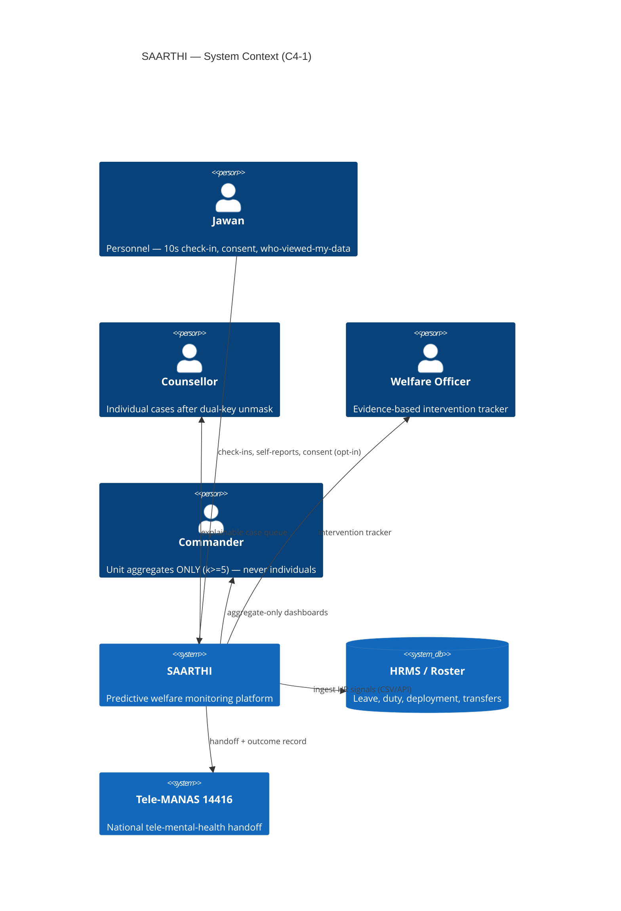
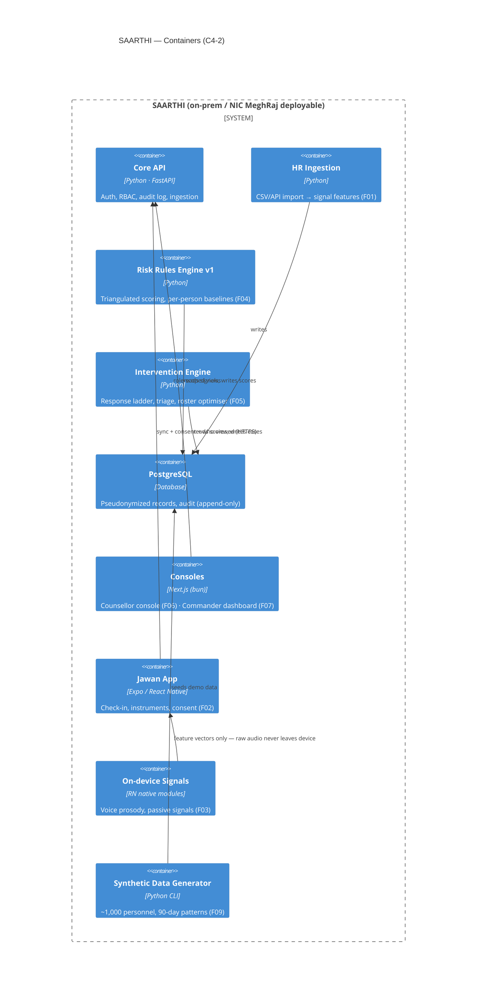

# Architecture — SAARTHI

> Owner: kv · Status: [~] drafting · Last updated: 2026-09-05
> Format: arc42-lite (sections 1, 3, 4, 6, 8, 12 only — full arc42 is overkill for a hackathon). Diagrams: C4 levels 1–2 as committed mermaid text.

## 1. Introduction & goals

SAARTHI converts welfare management from reactive (manual observation, self-reporting) to **predictive and preventive**, across four subsystems:

| Subsystem | Purpose | Lead |
|---|---|---|
| Signal layer | HR data + voluntary app + passive wellness | kv / neel |
| Inference layer | Rules engine v1 → ML v2, explainable | kv |
| Intervention layer | Response ladder, rebalancing, Tele-MANAS | kv / neel |
| Trust layer | k-anonymity, dual-key unmasking, audit | manan |

**Quality goals:** privacy enforced in architecture (ADR-0003) · explainability (NFR-05) · offline-first low-end Android (ADR-0005) · DPDP 2023 compliant (NFR-01) · deployable on-prem / air-gapped (NFR-03).

## 3. Context & scope (C4-1)

External systems: HRMS/roster data (CSV + API), Tele-MANAS 14416 (national tele-mental-health), wearables (optional, later). Users per PRD roles.



## 4. Building blocks (C4-2 containers)



**Key data-flow rule (architectural firewall):** `rules` writes scores to `db`; only the *counsellor-role query path* can resolve a score to an individual, and only through dual-key unmasking with logging. The commander container has **no API endpoint that accepts a personnel ID** for welfare data — enforced server-side, not by UI convention.

## 6. Runtime view — the demo loop (one persona, 90 days)

```mermaid
sequenceDiagram
    participant J as Jawan app
    participant API as Core API
    participant R as Rules Engine
    participant C as Counsellor
    participant Cmd as Commander
    J->>API: roster app usage (daily) + voluntary check-in
    API->>R: HR signals accumulate (60 duty days, 2 cancelled leaves, sleep −30%)
    R->>R: per-person baseline breach → Amber → Red
    R->>C: explainable alert (top factors listed)
    C->>API: dual-key unmask (with welfare officer) — logged
    C->>J: outreach ≤ 24h; roster swap proposed
    J->>API: risk trend drops (post-intervention)
    Cmd->>Cmd: sees only "3rd Bn: 22% elevated fatigue" (k ≥ 5)
    J->>J: opens who-viewed-my-data → sees exactly what happened
```

## 8. Architecture decisions

See [decisions/0001-rules-engine-v1-not-ml.md](decisions/0001-rules-engine-v1-not-ml.md):

- [ADR-0001](decisions/0001-rules-engine-v1-not-ml.md) — rules engine v1, ML v2 from counsellor labels
- [ADR-0002](decisions/0002-on-device-voice-inference.md) — on-device prosody; raw audio never leaves phone
- [ADR-0003](decisions/0003-two-tier-output-k-anonymity.md) — two-tier output + architectural firewall (k ≥ 5)
- [ADR-0004](decisions/0004-roster-app-first-adoption.md) — ship inside the roster app; never call it therapy
- [ADR-0005](decisions/0005-offline-first-low-end-android.md) — offline-first, low-end Android, icon-first UI
- [ADR-0006](decisions/0006-tech-stack.md) — FastAPI + Postgres + Next.js + Expo/RN

## 12. Glossary

| Term | Meaning |
|---|---|
| Jawan | Rank-and-file uniformed personnel |
| CAPF / CRPF | Central Armed Police Forces / Central Reserve Police Force |
| Circadian disruption score | Derived duty-load feature (night ratio × rotation speed) — [F01](../features/F01-hr-signal-engine.md) |
| Masking flag | Discrepancy between self-report and observed signals — "the faking is the finding" |
| k-anonymity | Aggregate suppressed unless ≥ 5 contributors |
| Dual-key unmasking | Counsellor + welfare officer must both approve to link pseudonym → identity; logged |
| Tele-MANAS | Govt. of India tele-mental-health service, 14416 |
| ACR | Annual Confidential Report — the appraisal record scores must never touch |
