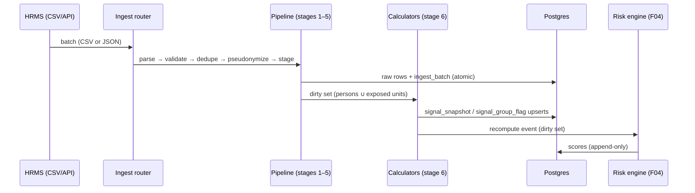

# Design — HR Signal Engine (F01)

> Owner: kv · Status: [x] implemented · Last updated: 2026-09-08
> Implements [F01](../../features/F01-hr-signal-engine.md) · Stack per [ADR-0006](../decisions/0006-tech-stack.md): Python 3.11+, FastAPI, PostgreSQL · Related: [design-risk-engine.md](design-risk-engine.md) (consumer)

## 1. Module breakdown (`backend/`)

```
backend/app/
  api/routers/
    hr_ingest.py          # POST /ingest/hr/csv, /ingest/hr/{dataset}
    signals.py            # GET /signals/* (role-scoped)
  ingest/
    csv_loader.py         # streaming CSV → pydantic row models
    schemas.py            # per-dataset row schemas, versioned
    dedupe.py             # natural-key + batch-hash idempotency
    quarantine.py         # bad-row capture + batch report
  signals/
    domain/leave.py       # L1–L4
    domain/duty.py        # D1–D4 (incl. circadian_disruption_score)
    domain/deployment.py  # E1–E3
    domain/career.py      # C1–C4
    domain/health.py      # H1–H4
    domain/events.py      # T1–T2 group exposure (gated V1–V3 live here, flag-off)
    calculator.py         # window orchestration
    snapshot.py           # upsert signal_snapshot / signal_group_flag
  core/
    pseudonym.py          # personnel_id → pseudonym_id (F08 vault client)
    jobs.py               # Postgres-backed job table + worker loop
    audit.py              # append-only audit writer
```

**Rule:** domain modules are pure — `(records, window, config, as_of) → value`, no I/O. Everything testable without a database.

## 2. Ingestion pipeline stages

| Stage | What | Failure handling |
|---|---|---|
| 0 receive | upload/push → `ingest_batch` row | row cap (413); reject empty batch |
| 1 parse | streaming CSV → row models | row-level errors → quarantine, batch continues |
| 2 validate | schema version, enums, date sanity | same |
| 3 dedupe | natural key (pseudonym, dataset, dates) + batch hash | re-import = no-op; conflicts → quarantine |
| 4 pseudonymize | `personnel_id → pseudonym_id` | unknown ID → quarantine; never fabricated |
| 5 stage | insert raw rows (append-only tables) | per-batch transaction |
| 6 compute | dirty set → domain calculators → snapshot upserts | per-person idempotent, resumable |
| 7 emit + audit | recompute event → F04; audit rows | event at-least-once; F04 recompute is idempotent |

**Batch contract:** stages 0–5 are atomic (all-or-nothing per batch); stage 6 resumes per person. A failed batch never leaves partial signals behind.

## 3. Caching & recompute strategy

- **`signal_snapshot` is the cache** — materialized in Postgres. No second cache layer to invalidate; one source of truth.
- **Incremental recompute:** dirty set = pseudonyms touched by the batch ∪ roster members of units with new/late incidents (group flags, FR-08).
- **Backdated records** widen the dirty set to the affected windows — window keys derive from record dates, not from today.
- **Full recompute triggers:** ruleset/config version change, schema migration, admin action. Plus a nightly full refresh as a drift safety net (cheap within the NFR-06 budget).
- **Idempotency:** upserts keyed `(pseudonym_id, signal_key, window_end)` — recompute is safe to re-run at any point.
- **Job model:** `job` table (type, payload, status, attempts) + single worker loop. No external broker — air-gap and NIC MeghRaj friendly (ADR-0006 deployment story). FastAPI BackgroundTasks handle small interactive batches; the worker handles bulk.



## 4. Testability hooks

- **Golden tests per signal** from fixture CSVs; F09's generator doubles as the fixture source.
- **Deterministic clock:** every calculator takes `as_of`; no `datetime.now()` in domain code — tests inject fixed dates.
- **Property tests:** window invariants (no signal computed outside its window; null never silently coerced to 0).
- **Integration:** disposable Postgres per CI run; assert snapshot rows after a seeded batch.
- **Contract tests:** CSV schema fixtures (v1, malformed, unknown-person, duplicate-batch).
- **Demo persona regression:** scripted 90-day values asserted end-to-end (traceable to test-plan).
- **Quarantine assertions:** the batch report itself is tested (bad rows counted, good rows still written).

## 5. Failure modes

| Failure | Behavior |
|---|---|
| Malformed CSV | stage-1 quarantine; rest of batch proceeds; report lists row + reason |
| Unknown personnel_id | quarantine, admin report; never fabricated |
| Duplicate batch re-send | stage-3 no-op (idempotent) |
| Backdated HRMS correction | dirty-window recompute (§3) |
| Huge file | streaming parse + row cap; no full-file memory load |
| DB unavailable mid-batch | stages 0–5 roll back; job stays retryable with attempts counter |
| Worker crash in stage 6 | per-person idempotency → resumes where it stopped |
| Config version bump mid-day | new signals stamped `engine_version`; history untouched (append-only) |
| Clock skew | all computation uses the scheduler-passed `as_of`, never the host clock |

## 6. Performance posture

NFR-06 target: full 1,000-person × 90-day recompute **< 60 s** on modest hardware. Approach: vectorised window aggregation per domain, indexed raw tables (`(pseudonym_id, duty_date)` etc.), one pass per dirty person. This is a battalion-scale problem that fits one box — no distributed machinery, consistent with the on-prem/air-gap deployment story.

## 7. Open questions

- Night-shift definition varies by roster convention — `shift_code` enum must be config, confirmed against real CRPF exports at pilot start.
- Leave-type taxonomy — enumerated from real HRMS export samples, never invented.
- Distance basis for `family_separation_index` (posting HQ vs unit location) — needs one HRMS field decision.
