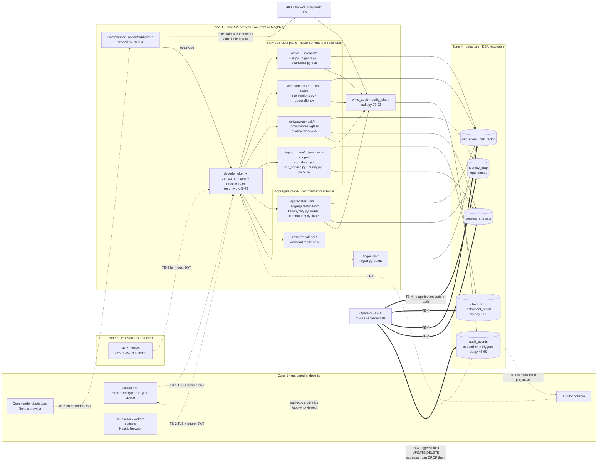

# Threat Model — SAARTHI (STRIDE walkthrough)

> Owner: neel · Status: [x] complete · Last updated: 2026-09-09
> Related: [security-model.md](../compliance/security-model.md) · [rbac-matrix.md](../compliance/rbac-matrix.md) · [security-test-cases.md](security-test-cases.md) · [test-plan.md](test-plan.md) §4/§9 · [F08](../features/F08-privacy-safety-architecture.md) · [ADR-0003](../architecture/decisions/0003-two-tier-output-k-anonymity.md) · [dpdp-2023-mapping.md](../compliance/dpdp-2023-mapping.md) · [mental-healthcare-act-2017.md](../compliance/mental-healthcare-act-2017.md)

> **Status banner — 2026-09-09 ~02:20.** This document was written against the `backend/` tree as it stood at ~02:00. Its red findings were acted on immediately: **16 of them are now fixed and carry automated regression cover** in `backend/tests/test_security_hardening.py`. Rows and prose below that describe a *closed* finding are marked **FIXED** / **CLOSED** inline with what was re-verified by execution. The **[test-plan.md](test-plan.md) §4 must-pass gate is GREEN**; the demo is not blocked. The *analysis* in each row is preserved as written — it is the reason the fix exists — but do not quote a severity or a line number from here without re-checking it against `git log`.

## 0. How to read this document

[security-model.md](../compliance/security-model.md) states the security **design**. This document states what the **code actually enforces** on 2026-09-09, boundary by boundary, and is deliberately unflattering where design and code disagree.

Rules this document follows:

1. Every "control" cell names the file **and line range** where the control lives. If a control is documented but I could not find it in `backend/`, the cell says **not found in code as of 2026-09-09** and the residual risk is raised accordingly.
2. Every threat carries a test-case ID in [security-test-cases.md](security-test-cases.md). A threat with no executable test is a threat we are only *asserting* we handle.
3. Residual risk is Low/Med/High reasoning, never a fabricated number (AGENTS.md rule 7).
4. Findings marked **[verified]** were reproduced by running the real API in-process against `seed_demo` fixtures on 2026-09-09; the reproduction steps are the given/when/then in the linked test case.
5. **Line numbers are a snapshot.** `backend/` was under active development while this was written — the client-surface routers (`self_service.py`, `counsellor.py`, `commander.py`, `pulse.py`, `buddy.py`) landed mid-analysis and are included. Re-verify citations against `git log` before quoting them in a review; the *findings* are stable, the *line numbers* drift.

**Route inventory at the time of analysis** — every path parameter in the API, which is what §5's IDOR rows enumerate:

`/risk/{pseudonym_id}` · `/risk/{pseudonym_id}/explanation` · `/risk/{pseudonym_id}/trend` · `/signals/{pseudonym_id}` · `/signals/group/{unit_id}/exposure` · `/interventions/{case_id}/actions` · `/interventions/{case_id}/outcome` · `/interventions/{case_id}/telemanas` · `/interventions/case/{case_id}` · `/interventions/case/{case_id}/timeline` · `/interventions/case/{case_id}/notes` · `/aggregates/unit/{unit_id}` · `/aggregates/unit/{unit_id}/morale` · `/aggregates/unit/{unit_id}/indicators` · `/aggregates/unit/{unit_id}/forecast` · `/aggregates/unit/{unit_id}/trend` · `/aggregates/unit/{unit_id}/pulse` · `/aggregates/simulations/{run_id}` · `/privacy/unmask/{request_id}/approve` · `/privacy/unmask/{request_id}/identity` · `/app/consent/withdraw/{bundle_id}` · `/ingest/hr/{dataset}` · `/ingest/hr/batches/{batch_id}/quarantine` · `/roster/rebalance/{proposal_id}` · `/roster/rebalance/{proposal_id}/approve` · `/welfare/personnel/{personnel_id}` · `/i18n/{lang}`

Scope: the Core API (`backend/`) and its trust boundaries. The Expo client and Next.js consoles are in scope only where they cross a boundary — client-side hiding is never a control here.

## 1. Assets (what an attacker is actually after)

| Asset | Store | Worst case if lost |
|---|---|---|
| A1 Identity map (pseudonym → personnel no. + legal name) | `identity_map` (`backend/app/models.py:39-50`) | Re-identification of every scored person; programme over |
| A2 Raw self-reports & instrument results | `check_in`, `instrument_result` | A jawan's own words used against him |
| A3 Derived risk score + tier + trend | `risk_score`, `risk_factor` | A discipline list; ADR-0003 breach |
| A4 Consent artefacts | `consent_artefacts` (`models.py:53-65`) | Legal defensibility of every disclosure |
| A5 Audit log | `audit_events` (`models.py:465-481`) | The tamper-evidence everything else leans on |
| A6 Unit aggregates | computed (`backend/app/privacy/kanonymity.py:26-69`) | Re-identification by differencing |
| A7 Session notes | `session_note` (`models.py:560-574`), served by `GET/POST /interventions/case/{case_id}/notes` (`counsellor.py:304-393`) | MHCA §23 confidentiality |
| A8 Raw HR signals | `hr_*` tables | Employment-scope data leakage; poisoned baselines |

## 2. Trust boundaries and data flow

Six boundaries. TB-6 is unusual: it is not a network boundary at all, it is an **authorization boundary inside one process** — that is exactly what ADR-0003 buys us, and it is why it gets its own STRIDE pass.

| ID | Boundary | Crossing principal | Enforcement point in code |
|---|---|---|---|
| TB-1 | Jawan device/browser → Core API | `jawan` | `security.py:62-79`, `app_data.py`, `privacy.py:298-392` |
| TB-2 | Console browser → Core API | `counsellor`, `welfare_officer`, `commander`, `auditor` | `security.py:73-79`, `risk.py`, `signals.py`, `interventions.py`, `privacy.py` |
| TB-3 | HR / HRMS ingest → Core API | `hr_ingest`, `admin` | `api/routers/ingest.py:25-96` |
| TB-4 | Operator / DBA → database | OS + DB credentials, **no application code in the path** | `db.py:45-69` (audit triggers only) |
| TB-5 | Auditor → audit log | `auditor` | `api/routers/audit_api.py:14-40`, `audit.py:73-93` |
| TB-6 | ADR-0003 command firewall (in-process) | `commander` | `firewall.py:16-104`, `privacy.py:405-421` |



Reading the diagram: dotted arrows are **trust-boundary crossings** (attacker-controlled input arrives here); double arrows are the DBA path, which **bypasses every application control** and is therefore the widest boundary in the system; solid arrows are in-process calls.

## 3. Attacker catalogue

| Code | Attacker | Capability assumed | Motive |
|---|---|---|---|
| AT-1 | **Curious commander** | Valid `commander` JWT, can read API docs, can craft arbitrary HTTP | "Who in my unit is cracking?" — ACR culture, not malice |
| AT-2 | **Malicious insider counsellor** | Valid `counsellor` JWT, legitimate console access | Curiosity browsing, personal grudge, or selling a name |
| AT-3 | **Compromised HR ingest account** | Valid `hr_ingest` JWT (phished or a leaked service credential) | Poison baselines, exfiltrate employment-scope data, DoS |
| AT-4 | **Stolen laptop / device** | An unlocked console or a jawan phone, live browser session | Opportunistic; whatever the session can reach |
| AT-5 | **DBA / platform operator** | Direct DB and filesystem access, superuser SQL | Cover a track, satisfy a "favour", or simple curiosity |
| AT-6 | **Network attacker** | Position between client and API; can host a hostile web origin | Session theft, credential replay, XSS-driven API use |
| AT-7 | **Subpoena / command coercion** | Lawful demand, or informal pressure on a keyholder | Compel disclosure of an individual |

## 4. STRIDE walkthrough per boundary

### TB-1 · Jawan device/browser → Core API

- **Spoofing.** Only username + password (PBKDF2-HMAC-SHA256 120k rounds, constant-time compare in `passwords.py:10-26`). **Login rate limiting FIXED ~02:20** — repeated failures now return 429; **[re-verified]** ten 401s followed by 429. MFA and device binding remain **not found in code as of 2026-09-09** and are pilot scope. On a shared bunker phone a jawan account is no longer one *unlimited* guessing run away, but it is still single-factor.
- **Tampering.** `POST /app/checkins` accepts a client-supplied `recorded_at` verbatim (`app_data.py:43-48`) and derives `expires_at` from it (`app_data.py:67`). A client that posts a future `recorded_at` writes a row the 90-day expiry job will never reach (`privacy/expiry.py:12-25` compares `recorded_at <= cutoff`).
- **Repudiation.** Consent grants are logged (`privacy.py:320-328`), but `artefact_hash` is `nid("h")` (`privacy.py:316`) — a random identifier, not a digest of the artefact's content. The artefact does not prove *what* was consented to; only the audit row does.
- **Information disclosure.** Self-scoped endpoints take **no path parameter**: `/app/who-viewed` and `/app/me/trend` key off `user.pseudonym_id` resolved from the DB (`privacy.py:361`, `app_data.py:130`). There is no IDOR surface here by construction — the strongest control on this boundary.
- **Denial of service.** Login throttling and an ingest upload cap landed ~02:20 (TC-457, TC-458). **General per-route rate limiting is still not found in code as of 2026-09-09** and remains pilot scope. Offline-first (ADR-0005) protects *the jawan's data*, not the API.
- **Elevation of privilege.** `require_roles` reads `user.role` from the DB row, not the token (`security.py:73-79`) — **[verified]** a jawan token is refused 403 on `/risk/*`, `/signals/*`, `/interventions/queue`, `/audit/events`, `/aggregates/*`.

### TB-2 · Console browser → Core API

- **Spoofing.** `decode_token` pins `algorithms=["HS256"]` (`security.py:50`), so `alg: none` and RS/HS confusion both fail — **[verified]** 401. Expiry is enforced by PyJWT via the `exp` claim (`security.py:42`, 12 h default `config.py:18`) — **[verified]** 401. The weak link is `config.py:17`: `jwt_secret` defaults to the literal `"saarthi-dev-secret-change-me-32b+"` committed in the repo. Any deployment that does not set `SAARTHI_JWT_SECRET` lets anyone mint any role.
- **Tampering.** A forged `role` claim signed with the real secret does **not** escalate: `get_current_user` re-reads the `User` row (`security.py:67`) and `require_roles` checks the DB role (`security.py:75`) — **[verified]** a `commander.3bn` principal with a token claiming `role: counsellor` gets 403 `insufficient role` on `/risk/{id}`.
- **Repudiation.** Every individual read writes an audit row with purpose and reason (`risk.py:59-68`, `signals.py:53-62`, `privacy.py:211-220`), and the subject sees it (`privacy.py:351-392`).
- **Information disclosure — the real hole on this boundary, and it is now a split verdict.** The API has two generations of individual-data routes and only the newer one is scoped:
  - **Unscoped (older):** `GET /risk/{pseudonym_id}` (`risk.py:49-83`), `GET /risk/{pseudonym_id}/trend` (`counsellor.py:395-403`) and `GET /signals/{pseudonym_id}` (`signals.py:39-67`) apply **no caseload condition and no consent condition** — role alone. **[verified]** `counsellor.a` read `ps_demo01`, `ps_3bn05` and `ps_tiny1` on `/risk/{id}` and `/risk/{id}/trend` with 200s. [rbac-matrix.md](../compliance/rbac-matrix.md) DT-02 promises "R pseudonymized, **consent-gated**"; that gate is not found in code as of 2026-09-09.
  - **Scoped (newer, and the pattern to copy):** `_assert_assigned` (`counsellor.py:72-99`) refuses a case assigned to another counsellor and a unit outside a welfare officer's `assigned_units`, auditing the denial as `case.deny` — it protects `/interventions/case/{case_id}`, `/timeline` and `/notes`. Two residual holes even here: an **unassigned** case (`assigned is None`, `counsellor.py:77`) is readable by any counsellor, and a welfare officer with an empty `assigned_units` is unscoped (`counsellor.py:88`).

  **CLOSED 2026-09-09 ~02:20.** The fix was never research — it was calling the function that already existed one file over, and that is what landed: the scope helpers were lifted into a new `backend/app/authz.py` (`may_read_subject`, `assert_subject_scope`, `assert_case_scope`) and are now called from *both* generations of route, with the two residual holes above (unassigned case, empty `assigned_units`) changed to deny. **[re-verified]** `counsellor.a` now gets **403** on `/risk/{id}`, `/risk/{id}/trend` and `/signals/{id}` for `ps_3bn05`, `ps_3bn07` and `ps_tiny2`. The detective control (every read lands in the subject's who-viewed feed) is unchanged and now backs a preventive one rather than substituting for it.
- **Denial of service.** None specific beyond TB-1.
- **Elevation of privilege.** CORS is `allow_origins=["*"]` with `allow_credentials=True` (`main.py:42-48`). Any web origin can drive the API in the browser of a logged-in counsellor.

### TB-3 · HR / HRMS ingest → Core API

- **Spoofing.** `require_roles("hr_ingest", "admin")` (`ingest.py:30`, `ingest.py:55`) and nothing else. No mTLS, no IP allow-list, no per-batch signature — not found in code as of 2026-09-09. A leaked service credential is a full ingest identity.
- **Tampering.** Dataset names are allow-listed (`ingest.py:33-34`, `ingest.py:58-59`); bad rows are quarantined rather than partially written (`models.py:82-91`); natural-key uniqueness blocks naive duplicates (`models.py:96`, `:114`, `:128`). What is missing is provenance: nothing proves a row came from the HRMS of record, so a compromised ingest account can silently move a person's duty-streak and leave-cancellation counts and thereby manufacture — or suppress — an Amber flag.
- **Repudiation.** Batches are audited (`ingest.py:39-46`, `:61-68`) but the audit payload records counts, not a content digest. `batch_hash` exists on the model (`models.py:79`) and is nullable.
- **Information disclosure.** `GET /ingest/hr/batches/{batch_id}/quarantine` (`ingest.py:72-82`) returns the **raw rejected row payloads**, and batch ids are predictable — `f"csv-{dataset}-{file.filename}"` (`ingest.py:37`).
- **Denial of service.** `file.file.read()` (`ingest.py:35`) loads the whole upload into memory with no size cap.
- **Elevation of privilege.** `hr_ingest` can also call `POST /risk/recompute` (`risk.py:40`) and `POST /signals/recompute` (`ingest.py:89`) — compute, not content. Acceptable.

### TB-4 · Operator / DBA → database

This boundary has **no application code in the path at all**, which makes it the widest one in the system. Honest statement of position:

- **Tampering.** The only DB-level integrity control in the repo is the pair of append-only triggers on `audit_events` (`db.py:45-69`). Nothing protects `risk_score`, `consent_artefacts`, `identity_map` or `users` from a direct `UPDATE`. There is no role-grant table, no row-level security, and no separate application DB role — the dev store is a single SQLite file (`config.py:16`).
- **Tampering, deeper.** A superuser can `DROP TRIGGER` and then edit the log. The hash chain is the backstop and it works for **content**: **[verified]** after dropping both triggers and editing `reason` on row 1, `GET /audit/verify` returned `{"ok": false, "broken_at": 1}`. But the chain does **not** cover the timestamp: `at` is a column (`models.py:469`) that is excluded from the hashed body (`audit.py:41-52`) and from the recomputed body in `verify_chain` (`audit.py:77-88`). **[verified]** rewriting `at` to `2020-01-01` left `verify_chain` reporting `{"ok": true}`. A DBA can therefore rewrite **when** an access happened without detection — which is precisely the fact a who-viewed receipt turns on.
- **Information disclosure.** No encryption at rest, no envelope encryption of `identity_map` or raw self-reports, no KMS integration — not found in code as of 2026-09-09. `identity_map.legal_name` is a plaintext column (`models.py:49`). [security-model.md](../compliance/security-model.md) claims AES-256-GCM with envelope encryption; that is a target state, not v1 code.
- **Elevation of privilege.** No endpoint anywhere in `backend/app/api/routers/` writes `User.role`. Role changes therefore happen by direct DB write — i.e. they inherit every weakness above, and rbac-matrix's "role changes require approval and are logged" is not found in code as of 2026-09-09.

### TB-5 · Auditor → audit log

- **Information disclosure (in the good direction — auditor content-blindness).** `GET /audit/events` projects only `id, at, actor_role, action, resource_type, denied, purpose` (`audit_api.py:29-40`). `reason`, `payload` and `subject_pseudonym_id` never leave the API on this route. Content-blindness (rbac-matrix DT-01/02/08) **holds** here.
- **Repudiation.** `verify_chain` walks from GENESIS forward (`audit.py:73-93`) and reports the first mismatch. It cannot detect a **truncated tail**: deleting the last N entries leaves a chain that verifies perfectly, because there is no signed head, no external anchor, and no expected-count register.
- **Tampering.** `/audit/events` is capped at 200 rows (`audit_api.py:27`) with no paging or filtering, so a full-history review is not currently possible through the API.
- **Elevation of privilege.** `admin` can call `/audit/verify` but not `/audit/events` (`audit_api.py:17` vs `:25`) — **[verified]** admin 200 on verify, 403 on events. That matches rbac-matrix DT-07 ("W append only" for admin).

### TB-6 · The ADR-0003 command firewall (in-process authorization boundary)

Two independent layers plus a trap route:

1. **Middleware** (`firewall.py:70-104`): decodes the bearer token, and if the `role` claim is `commander` and the path matches `COMMANDER_DENIED_PREFIXES` (`firewall.py:16-26`) it writes a `firewall.deny` audit row and returns 403 without ever reaching a handler.
2. **Handler** (`firewall.py:52-67`): `forbid_commander()` audits and raises 403 for any commander principal that reaches a welfare handler. **[verified]** in isolation with the middleware bypassed: raises `HTTPException 403` and appends a `firewall.deny` row with reason `ADR-0003 commander cannot access individual welfare data`; a counsellor principal passes through untouched.
3. **Trap route** (`privacy.py:405-421`): `GET /welfare/personnel/{personnel_id}` exists solely to answer the judge's attack and always 403s with an audit row, for every role.

- **Spoofing.** The middleware trusts the token's `role` claim (`firewall.py:81`), not the DB. A principal promoted to `commander` whose old `counsellor` token has not yet expired slips past the *middleware* — and is then stopped by the handler's DB-role check (`security.py:75`). Belt and braces working as designed; the failure mode is over-blocking (a demoted commander is blocked for up to 12 h), not under-blocking.
- **Information disclosure — the allow-list gap.** `path_denied_to_commander` (`firewall.py:38-49`) returns **False** for `/jobs/*`, `/audit/*`, `/i18n/*` and `/roster/rebalance*`. **[verified]** `path_denied_to_commander("/jobs/expire-raw") is False`; the request is only stopped by `require_roles("admin")` at `privacy.py:398`. On those paths only one layer is holding.
- **Information disclosure — path normalisation.** **[verified]** `/./risk/x`, `/risk//x`, `/risk/x/` and `/risk%2Fx` are all caught (Starlette normalises before the middleware sees `request.url.path`); `/Risk/x` and `//risk/x` return 404 because no route matches, so they leak nothing either.
- **Information disclosure — differencing via the aggregate. Found live, since FIXED — see the closure note below.** `aggregate_unit` suppressed cells with `0 < n < k` and then suppressed one complement cell — but it still published `morale_index = green / n` and `elevated_share` computed from the **raw** counts, and published `n` whenever `n >= k`. **[verified against a running server on the seeded demo data, 2026-09-09 ~02:00]**, `GET /aggregates/unit/3BN` with the `commander.3bn` token returned:

  ```json
  {"unit_id":"3BN","k":5,"n":12,"n_suppressed":false,
   "cells":{"green":{"n":null,"suppressed":true},"amber":{"n":null,"suppressed":true},
            "red":{"n":0,"suppressed":false},"critical":{"n":0,"suppressed":false}},
   "elevated_share":null,"morale_index":0.917,"suppressed_keys":["amber","green"]}
  ```

  `green = round(0.917 × 12) = 11`, therefore `amber = 12 − 11 − 0 − 0 = **1**`. The commander has just recovered a cell containing **one person** from a response whose own body says `suppressed: true`. `suppressed_keys` even names which tier is the small one. On a 12-person unit, "exactly one man in 3BN is Amber" plus a CO's own knowledge of who has been on continuous duty is a re-identification, not a statistic. Reproduced a second time with a hand-set 3-amber/9-green distribution: `n = 12`, `morale_index = 0.75` → `green = 9` → `amber = 3`.

  This was a red case on the [test-plan.md](test-plan.md) §4 must-pass gate (TC-402's intent, TC-451's assertion) and blocked the demo under AGENTS.md rule 9.

  > **CLOSED 2026-09-09 ~02:20 — re-verified by execution.** `aggregate_unit` now computes `elevated_share` and `morale_index` only when *no* cell is suppressed and `n >= k`; otherwise both are `null`. The response no longer carries `suppressed_keys` at all — it publishes `suppressed_cells` as a bare **count**, so a reader cannot tell *which* tier was small. The same request now returns `morale_index: null`, `elevated_share: null`, `suppressed_cells: 2`, leaving nothing to subtract from. Regression cover: `backend/tests/test_security_hardening.py::test_tc451_*`.
- **Information disclosure — complement suppression skips empty cells. FIXED.** The complement was chosen from cells with a **truthy** count, so a `n = 0` cell could never be the complement; in sparse units the "complement" was either a large real cell or nothing at all. `_choose_suppressions` now ranks *all* remaining tiers by `(count, name)` including zero-count cells, so the second suppression always happens. **[re-verified]** unit 3BN suppresses `amber` (1) **and** `critical` (0). Regression cover: `::test_tc452_*`.
- **Elevation of privilege.** The commander surface for roster work is correctly narrowed: `/roster/rebalance` POST excludes commander entirely (`interventions.py:206`) and `GET /roster/rebalance/{proposal_id}` refuses `welfare_weighted` proposals to command and masks the mode field (`interventions.py:257-271`). **[verified]** commander POST to `/roster/rebalance` → 403 `insufficient role`.
- **Cross-unit.** `unit_aggregate` scopes a commander to their own unit (`privacy.py:63-64`) — **[verified]** `commander.tiny` requesting `/aggregates/unit/3BN` → 403. The guard is conditional on `user.unit_id` being set, so a commander account seeded without a unit would be unscoped.

## 5. Threat register

Residual risk is *after* the control named in the row. `TC-` ids resolve in [security-test-cases.md](security-test-cases.md).

| ID | STRIDE | Asset | Attacker | Existing control (file:line) | Residual | Test |
|---|---|---|---|---|---|---|
| THR-01 | S | A2, A4 | AT-4 stolen laptop | Password login only — PBKDF2 120k + constant-time compare `passwords.py:10-26`; 12 h token. **Lockout FIXED ~02:20**: repeated failures now return 429 — **[re-verified]** 10×401 then 429. MFA and device binding remain **not found in code** and are pilot scope | Med (was High) | TC-457 |
| THR-02 | S | A3 | AT-6 network | `decode_token` pins HS256 `security.py:47-52`; `exp` set at `security.py:42` | Low | TC-410…413 |
| THR-03 | S | all | AT-6 network | `jwt_secret` **defaults to a repo-committed literal** `config.py:17`; env override via `SAARTHI_` prefix `config.py:14` | **High** until deploy-time secret is enforced | TC-415 |
| THR-04 | T | A3 | AT-2 counsellor | Forged `role` claim defeated — DB role re-read `security.py:67`, checked `security.py:75` | Low | TC-414 |
| THR-05 | E | A2, A3 | AT-1 commander, AT-2 | `require_roles` deny-by-default `security.py:73-79` | Low | TC-416, TC-417 |
| THR-06 | I | A3, A8 | AT-2 counsellor | At ~02:00: **no caseload and no consent condition** on `GET /risk/{pseudonym_id}`, `/risk/{pseudonym_id}/trend` or `GET /signals/{pseudonym_id}` — rbac-matrix DT-02's "consent-gated" promise was not in code, leaving audit + who-viewed as the only (detective) control. **FIXED ~02:20** — subject-scope helpers in the new `authz.py` are now called from all three routes; **[re-verified]** `counsellor.a` gets **403** on all three for `ps_3bn05`, `ps_3bn07`, `ps_tiny2` | Low (was High) | TC-418, TC-419 |
| THR-07 | I | A3 | AT-2 counsellor | **Split verdict.** The newer case routes enforce assignment: `_assert_assigned` `counsellor.py:72-99` guards `/interventions/case/{case_id}`, `/timeline`, `/notes` and audits `case.deny`. The **older** routes do not: `interventions.py:81-114`, `:117-164`, `:167-199` fetched by `db.get(ResponseCase, case_id)` with no assignee check, so a counsellor could add actions, close a case and file a Tele-MANAS referral against a case that was not theirs. **FIXED ~02:20** — `assert_case_scope` (`authz.py`) is now called by the older routes too | Low (was Med) | TC-420 |
| THR-07b | I | A3, A7 | AT-2 counsellor | Even the guarded path leaves two gaps: an **unassigned** case (`assigned is None`, `counsellor.py:77`) is readable by any counsellor, and a welfare officer with an empty `assigned_units` is unscoped (`counsellor.py:88`) | Med | TC-420b |
| THR-08 | I | A6 | AT-1 commander | Commander scoped to own unit on every aggregate route: `privacy.py:63-64`, `_guard_unit` `commander.py:57-59`, `_units` `commander.py:62-67`. **[verified]** cross-unit 403, `/aggregates/units` returns one unit for a commander | Low | TC-421 |
| THR-08b | I | A6 | AT-1 commander | **All** of those guards are conditional on `user.unit_id` being non-null (`commander.py:58`, `privacy.py:63`) — a commander row with a null unit is unscoped across every unit. No seed or login assertion prevents it | Med | TC-421 |
| THR-09 | I | A6 | AT-2 counsellor | `{unit_id}` unscoped for counsellor/welfare/auditor on `privacy.py:57-74` and `signals.py:16-36`; both surfaces are group-level only | Low | TC-422 |
| THR-10 | I | A1 | AT-2 counsellor | Keyholder-only identity read `privacy.py:206-207`; grant status + expiry checked `privacy.py:204-205` | Low | TC-423 |
| THR-11 | I | A8 | AT-3 HR ingest | `GET /ingest/hr/batches/{batch_id}/quarantine` returns raw rejected payloads `ingest.py:72-82`; batch ids predictable `ingest.py:37` | Med | TC-424 |
| THR-12 | E | A1…A5 | AT-6 network | CORS was `allow_origins=["*"]` **with** `allow_credentials=True`, so an `Origin: https://evil.example` preflight was answered with that origin reflected plus `allow-credentials: true`. **FIXED ~02:20** — origins are an explicit console allow-list; **[re-verified]** a request with `Origin: https://evil.example` gets **no** `access-control-allow-origin` header, and the preflight is refused | Low (was High) | TC-456 |
| THR-13 | I | A3 | AT-1 commander | Middleware `firewall.py:70-104` + denied prefixes `firewall.py:16-26` | Low | TC-426, TC-429, TC-430 |
| THR-14 | I | A3 | AT-1 commander | Handler `forbid_commander` `firewall.py:52-67` — independent of the middleware | Low | TC-427 |
| THR-15 | I | A1 | AT-1 commander | Trap route always 403 + audit `privacy.py:405-421` | Low | TC-430 |
| THR-16 | I | A3 | AT-1 commander | Middleware allow-list gap: `/jobs/*`, `/audit/*`, `/i18n/*`, `/roster/rebalance*` returned False from `path_denied_to_commander`, so only `require_roles` held there. **FIXED ~02:20** — `/jobs` is in the deny list, restoring two independent layers on that path | Low (was Med) | TC-428 |
| THR-17 | I | A6 → A3 | AT-1 commander | **Differencing — found exploitable ~02:00, FIXED ~02:20.** `morale_index`/`elevated_share` were published from raw counts alongside `n`, defeating cell suppression; `/aggregates/unit/3BN` yielded `n=12, morale_index=0.917` → `amber = 1` recovered. Now both ratios are withheld whenever any cell is suppressed, and `suppressed_keys` is replaced by a bare `suppressed_cells` count. **[re-verified]** same request → `morale_index: null` | Low (was High — §4 gate red) | TC-451 |
| THR-18 | I | A6 | AT-1 commander | Complement suppression picked only truthy-count cells, so zero cells were never chosen. **FIXED** — all remaining tiers are now ranked by `(count, name)`, zero included. **[re-verified]** 3BN suppresses `amber` (1) **and** `critical` (0) | Low (was Med) | TC-452 |
| THR-19 | I | A6 | AT-1 commander | Longitudinal / repeated-slice inference. No query budget and no noise; the fixed unit cell was the only control until `GET /aggregates/unit/{unit_id}/trend` (`commander.py:449-475`) began returning a **per-week `elevated_share` series** and `/forecast` (`:428-447`) an 8-week projection. Each point is k-suppressed, but the sequence is a richer target than a single cell | Med | TC-450b, and residual by design (ADR-0003) |
| THR-20 | E | A1 | AT-2 + AT-7 coercion | Dual-key: same-principal guards `privacy.py:136-149`, `:161-174`; `User.role` is scalar `models.py:30` so one account cannot hold both roles | Low for one account | TC-431, TC-433 |
| THR-21 | E | A1 | AT-2 malicious counsellor | **Two accounts, one human** defeats dual-key: the guards compare `user.id` only, and nothing links a human to accounts. **[verified]** a second `welfare_officer` account supplied the second key and the counsellor read the legal name | Med — compensated by audit + oversight board only | TC-432 |
| THR-22 | E | A1 | AT-2 counsellor | Break-glass had **no consent precondition and no rate limit**, and returned `legal_name` for a subject who had withdrawn all consent. **Rate limit FIXED ~02:20** — a weekly cap returns 429 and demands an explicit `acknowledge_oversight` past the cap, with a `break_glass.throttled` audit row. The absence of a consent precondition is **deliberate** (that is what break-glass is for); notification and oversight flag are unchanged | Med — detective plus a cost | TC-438 |
| THR-23 | I | A1 | AT-2 counsellor | Break-glass `expires_at` `privacy.py:245` is **recorded but never enforced** — the identity is returned in the POST response itself `privacy.py:284-294`, so the 24 h window is a review window, not an access window | Med | TC-439 |
| THR-24 | R | A4 | AT-2, AT-7 | Unmask requires an active consent artefact `privacy.py:86-97` and a purpose from a closed vocabulary `privacy.py:30-36`, `:84-85` — **[verified]** 403 after withdrawal, 400 on `purpose_string: ACR_review` | Low | TC-434, TC-435 |
| THR-25 | T | A2 | AT-1 device owner | Consent gate on all three voluntary writes `app_data.py:57-58`, `:81-82`, `:109-110` via `consent.py:23-33` — **[verified]** all three 403 after withdrawal | Low | TC-445…447 |
| THR-26 | I | A4 | AT-1 commander | Silent withdrawal: no command-visible read path from the consent store; **[verified]** the commander aggregate payload contains no consent/withdrawal field before or after | Low | TC-448 |
| THR-27 | T | A2 | AT-4 device | Client-controlled `recorded_at` set `expires_at`, so a future date made a row immortal against the expiry job. **FIXED ~02:20** — `_day()` now routes the client value through `clock.clamp_capture_date(raw, as_of())`, so it stays useful as a *reported* offline timestamp but can never drive retention | Low (was Med) | TC-455 |
| THR-28 | R | A4 | AT-7 subpoena | `artefact_hash` was a random id, not a digest, so the artefact did not self-prove its content. **FIXED ~02:20** — `consent.artefact_hash()` now hashes the canonical content (principal, bundle, purpose, categories, language, version, `granted_at`), so a later edit of the purpose string or category list is detectable | Low (was Med) | TC-449 |
| THR-29 | T | A2 | AT-5 DBA | 90-day expiry purges check-ins and instruments `expiry.py:11-27` and is idempotent via the `purged` flag `expiry.py:15`, `:21` — **[verified]** run 1 purged 1+1, run 2 purged 0+0 | Low | TC-453 |
| THR-30 | I | A2 | AT-5 DBA | `PassiveFeature` rows were **never purged** — `expire_raw` handled only `CheckIn` and `InstrumentResult`, and a 2026-01-01 passive row survived two expiry runs intact. **FIXED ~02:20** — `expire_raw` now deletes expired `PassiveFeature` rows and blanks expired `VoiceFeature` rows, and reports `passive_purged` / `voice_purged` counts | Low (was Med) | TC-454 |
| THR-31 | D | A2 | operational | The expiry job runs only when an admin calls `POST /jobs/expire-raw` `privacy.py:395-402`; no scheduler in code (already conceded in [dpdp-2023-mapping.md](../compliance/dpdp-2023-mapping.md):99) | Med | TC-453 |
| THR-32 | T | A5 | AT-5 DBA | Append-only triggers `db.py:45-69`, installed by `init_db` `db.py:72-77` — **[verified]** UPDATE from the app connection aborts | Low against the app; **High** against a superuser who can DROP them | TC-440 |
| THR-33 | T | A5 | AT-5 DBA | Hash chain `audit.py:17-19`, `:27-70`, verified by `audit.py:73-93` — **[verified]** content edit after dropping the triggers gives `{"ok": false, "broken_at": 1}` | Med — detects, does not prevent | TC-441 |
| THR-34 | T | A5 | AT-5 DBA | Timestamps were outside the chain: `at` was absent from the hashed body and from `verify_chain`'s recomputation, so rewriting `at` left the chain valid. **FIXED** — `at` and `seq` are now both inside the hashed body and recomputed on verify. **[re-verified]** with both append-only triggers dropped, rewriting `at` gives `{"ok": false, "broken_at": 1, "reason": "entry_modified"}` | Low (was High) | TC-442 |
| THR-35 | R | A5 | AT-5 DBA | Tail truncation was undetected — `verify_chain` had no signed head, no anchor, no expected count. **FIXED** — a new `AuditCheckpoint` row (`entry_count` + `head_hash`, advanced on every write) is compared on verify, so a removed tail returns `entry_count_mismatch` and a rewritten head returns `head_mismatch`. Still *detection*, not prevention, and the checkpoint row itself is only as trustworthy as the DB — an external anchor remains future scope | Med → Low | TC-443 |
| THR-36 | I | A2, A7 | AT-2, AT-5 | Auditor content-blindness holds at the API: `audit_api.py:29-40` projects no `reason`, `payload` or `subject_pseudonym_id` | Low | TC-444 |
| THR-37 | R | A5 | AT-2 counsellor | Who-viewed shows only 9 whitelisted actions `privacy.py:363-375`, excludes denials `privacy.py:362`, caps at 100 rows `privacy.py:379` — a future read action silently never reaches the receipt | Med | TC-459 |
| THR-38 | I | A1, A2 | AT-5 DBA, AT-4 stolen host | Encryption at rest / envelope encryption / KMS **not found in code as of 2026-09-09**; `identity_map.legal_name` plaintext `models.py:49`; dev store is a SQLite file `config.py:16` | **High** | TC-460 |
| THR-39 | E | A1…A5, A8 | AT-5 DBA | No DB grants, no row-level security, no application-role separation; role changes have no endpoint and therefore happen by direct DB write | **High** | TC-460 |
| THR-40 | S | A8 | AT-3 HR ingest | Bearer-token role check only `ingest.py:30`, `:55`; mTLS / IP allow-list / batch signature **not found in code as of 2026-09-09** | Med | TC-425 |
| THR-41 | T | A8 → A3 | AT-3 HR ingest | Dataset allow-list `ingest.py:33-34`, quarantine `models.py:82-91`, natural keys `models.py:96`,`:114`,`:128`; no row provenance signature | Med | TC-426 |
| THR-42 | D | availability | AT-3 HR ingest | `file.file.read()` read the whole upload with no size cap. **FIXED ~02:20** — the ingest route enforces a maximum upload size and refuses anything larger. Login is now throttled too (THR-01); general per-route rate limiting is still absent and remains pilot scope | Low (was Med) | TC-458 |
| THR-43 | I | A7 | AT-1, AT-2, AT-5 | Session notes are now served by `GET/POST /interventions/case/{case_id}/notes` (`counsellor.py:304-393`), guarded by `_assert_assigned` (`counsellor.py:72-99`) and by the commander middleware (`/interventions` is a denied prefix, `firewall.py:16`). **[verified]** commander 403, auditor 403 (content-blind holds), assigned counsellor 200. Note MHCA §23 says notes are **excluded** from the 90-day TTL ([F08](../features/F08-privacy-safety-architecture.md) §4) — so `free_text` (`models.py:573`) is the longest-lived unencrypted clinical content in the system, which makes THR-38 sharper, not milder | Med — inherits the at-rest gap | TC-420b, TC-460 |
| THR-44 | I | A1 | AT-7 subpoena / coercion | Dual-key + purpose vocabulary + subject-visible receipt make a compelled disclosure *visible* (`privacy.py:363-375` includes `identity.read`, `unmask.grant`, `break_glass.open`). No legal-hold, no refusal path, no duress code in code | Med-High — governance control, not a technical one | — (oversight board, §7) |

## 6. Abuse cases — the four ways this becomes a discipline tool

This is the section a jury should read first. Each row is the *product* failure that ADR-0003 exists to prevent, and the **structural** control that blocks it — structural meaning "a route does not exist", not "a screen does not show it".

### AC-1 · A score leaks into an ACR or appraisal

**The abuse.** A commander or a staff officer obtains an individual risk score or tier and writes it into an Annual Confidential Report, a posting note, or a promotion board input.

**Structural control.** There is no endpoint that will return an individual score to a commander identity, and there are three independent reasons why:
1. `require_roles("counsellor", "welfare_officer")` on `risk.py:53` and `risk.py:90` — `commander` is not in the tuple, so the route does not exist for that role.
2. `CommanderFirewallMiddleware` (`firewall.py:70-104`) returns 403 before the handler for every path under `/risk`, `/signals`, `/interventions`, `/app`, `/welfare`, `/privacy/unmask`, `/privacy/break-glass` (`firewall.py:16-26`).
3. `forbid_commander` (`firewall.py:52-67`) is called *inside* the handlers as well, so removing the middleware does not open the door.

Plus a deliberate honeypot: `GET /welfare/personnel/{personnel_id}` exists **only** to 403 and write an audit row (`privacy.py:405-421`) — the attack the judges will try is pre-answered with evidence rather than an assurance.

**Residual — was a red gate at ~02:00, closed at ~02:20.** THR-17: on the shipped demo fixture a commander could recover `amber = 1` in unit 3BN from `n` and `morale_index`, in a response that marked that very cell `suppressed: true` — a count of one in a named 12-person unit is close enough to a name that AC-1 was only *mostly* blocked. Both prescribed fixes have landed: the ratios are withheld whenever any contributing cell is suppressed, and `suppressed_keys` is gone from the commander projection in favour of a bare count. **[re-verified by execution]** the response now carries `morale_index: null`, `elevated_share: null`, `suppressed_cells: 2`.

The genuine remaining residual is narrower and unchanged: `n` is still published when `n >= k`, so a commander who can observe the *same unit over time* can difference successive responses as people move between tiers. Fixed cell definitions (unit × week) bound this; differential-privacy noise is future scope ([ADR-0003](../architecture/decisions/0003-two-tier-output-k-anonymity.md)). This is a longitudinal inference risk, not a single-query re-identification, and it is tracked as TC-450b.

### AC-2 · Unit ranking becomes a punishment list

**The abuse.** Aggregates are used to rank units, and the bottom-ranked unit's CO is punished — which pushes every CO to suppress reporting and destroys the data.

**Structural control.** The commander surface is **scoped to a single unit — the commander's own — on every route**, including the heatmap grid that would otherwise be the ranking:

- `GET /aggregates/units` (`commander.py:109-144`) looks like a ranking API and is not: `_units` (`commander.py:62-67`) filters the list to the caller's own unit for a commander, while counsellor / welfare / auditor see all. **[verified]** `commander.3bn` → `['3BN']`, `commander.tiny` → `['TINY']`, `counsellor.a` → `['3BN','TINY']`.
- Every per-unit route — `/aggregates/unit/{unit_id}` (`privacy.py:57-74`), `/morale`, `/indicators`, `/forecast`, `/trend`, `/pulse` (`commander.py:146-475`, `pulse.py:135`) — calls `_guard_unit` (`commander.py:57-59`) or the equivalent inline check. **[verified]** `commander.tiny` → `/aggregates/unit/3BN/morale` returns 403.
- No route sorts units, and none accepts an ad-hoc grouping. A ranking cannot be *fetched*; a CO could only assemble one by hand across units they cannot reach, and every read is audited (`commander.py:131-138`, `privacy.py:66-73`).

**Residual, twice over.** (1) All the `_guard_unit`-style checks are conditional on `user.unit_id` being non-null (`commander.py:58`, `privacy.py:63`), so a commander account seeded without a unit sees **every** unit — a data-integrity bug that becomes an authorization bug. Assert at seed and login that no commander has a null `unit_id`. (2) `GET /aggregates/unit/{unit_id}/trend` returns a **per-week series** of `elevated_share` (`commander.py:449-475`), which is exactly the repeated-slice surface THR-19 names — k-suppressed per point, but a longitudinal sequence is a richer inference target than a single cell, and one a punishment-minded reader would use as "the trend under this CO".

**Residual.** This is a policy boundary as much as a technical one. The oversight board (F08 §6) reviews any request to widen the aggregate surface, and rbac-matrix "Change control" makes widening a cell require an ADR.

### AC-3 · Consent withdrawal becomes observable — and therefore a signal

**The abuse.** If a commander can see *that* someone withdrew, withdrawal itself becomes the flag, and nobody withdraws. This is the abuse that would quietly kill the programme.

**Structural control.** The consent store has **no command-visible read path at all**. `withdraw_all` (`consent.py:36-47`) touches only `consent_artefacts`; `POST /app/consent/withdraw` (`privacy.py:332-348`) writes one audit row with `reason="silent_withdrawal"` and returns `{"withdrawn": n, "command_visible": false}`. The commander's only welfare surface — the unit aggregate — is computed from `identity_map` and `risk_score` (`kanonymity.py:12-23`) and never reads the consent store, so there is no field to read, no gap to notice, and no cell that changes shape. **[verified]** the aggregate payload for `3BN` contains no `consent` or `withdraw` substring before or after a withdrawal, and `k` is unchanged.

**Residual.** Note the second-order channel: after withdrawal the voluntary writes 403 (`app_data.py:57-58`), so the person's score confidence degrades over time. Confidence is not on the commander surface today (`kanonymity.py:61-69` returns no confidence field), so the channel is closed — but any future aggregate field derived from data *density* would reopen it. Flag for review on every aggregate change.

### AC-4 · Curiosity browsing by a counsellor

**The abuse.** A counsellor looks up a colleague, a rival, or a relative "just to see", and the score becomes gossip in the mess.

**Structural control — was the weakest of the four at ~02:00, closed at ~02:20.** The preventive control that rbac-matrix promises — consent-gated, caseload-scoped reads on DT-02 — **was not implemented**: `GET /risk/{pseudonym_id}` and `GET /signals/{pseudonym_id}` authorized on role alone, and `counsellor.a` read three unrelated pseudonyms with 200s.

**Now both halves are present.** The preventive half: `authz.py` scopes every individual read to the caller's caseload or an active unmask grant — **[re-verified]** 403 on all three routes for three unrelated pseudonyms. The detective half, which was always the unusual part, is unchanged: every such read writes `risk.read` / `signals.read` with an actor role, purpose and reason (`risk.py:59-68`, `signals.py:53-62`), and the subject sees it in their own app (`privacy.py:351-392`). Access is both prevented where it is not warranted and visible to the person accessed where it is.

**Required fix before pilot — DONE 2026-09-09 ~02:20** (implemented by the `backend/` owner from this specification; I do not edit `backend/`):
1. ~~Require an open `ResponseCase` for the pseudonym with `assigned_counsellor_id == user.id`, **or** an active unmask grant, before the risk and signals routes return anything.~~ **Implemented** in `authz.may_read_subject` / `assert_subject_scope`, called from all three routes; regression cover `test_security_hardening.py::test_tc418_*`, `::test_tc419_*`.
2. Add the consent check `active_consent(db, pseudonym_id)` that `privacy.py:86` already performs for unmask.
3. Rate-limit distinct-pseudonym reads per counsellor per day, and surface the count to the oversight board — browsing is a *volume* signature, not a single-request one.

## 7. What we deliberately do not defend against in v1

Stating these is the point. An unstated non-defence is a lie of omission; a stated one is a scope decision a jury can challenge.

1. **A hostile root on the application host.** Anyone with root can read the process memory, the JWT secret and the database file. On-prem/MeghRaj physical and OS custody carries this, not us. Consequence: **every claim in this document is conditional on host integrity.**
2. **A colluding pair of genuinely distinct keyholders.** Dual-key raises the cost of unmasking from one person to two and makes it permanently visible; it cannot stop two people who both decide to do it. The compensating controls are the audit chain, the subject's receipt, and the oversight board with a serving jawan on it (F08 §6). Explicitly *not* covered: **one human operating two accounts** (THR-21) — v1 has no human-identity linkage to detect it.
3. **Statistical inference from repeated aggregate queries over time.** k ≥ 5 with fixed unit cells blocks single-query re-identification, not a patient observer correlating weekly aggregates against known transfers and postings. Differential-privacy noise and a query budget are post-v1 (ADR-0003).
4. **Traffic analysis and metadata.** An observer who can see *that* a jawan opened the app, or *that* a counsellor's console called the API, learns something even with TLS. Padding and cover traffic are out of scope.
5. **Malicious or rooted jawan devices.** The client can lie about `recorded_at`, replay its own queue, or submit fabricated check-ins (THR-27). The blast radius is that person's own record; server-side scoring never trusts a client-supplied score. We do not attempt attestation on API-26-era hardware.
6. **A compromised HRMS upstream.** If the system of record is wrong, our signals are wrong. We validate shape (`ingest.py:33-34`) and quarantine bad rows, we do not verify truth.
7. **Denial of service.** No rate limiting, no quotas, no WAF in v1. A DoS costs availability of *help routing*; the offline queue (ADR-0005) means it does not cost a jawan's data. This is a conscious trade for a 15-day prototype and must not ship to pilot.
8. **Coerced disclosure through lawful process** (AT-7). A subpoena or a lawful demand is answered through legal channels, not by a technical refusal path. What the architecture guarantees is that the disclosure is *dual-keyed, purpose-stamped, and visible in the subject's receipt* — it makes compelled access accountable, not impossible.
9. **Supply-chain compromise of dependencies.** No SBOM, no pinned hashes, no dependency scanning in the repo (`backend/requirements.txt` uses `>=` ranges throughout). A pilot needs pinned versions and a scan gate.
10. **Insider threat from the DBA role itself** (THR-32…THR-34, THR-38, THR-39). We detect content edits and we prevent app-mediated ones; we do not prevent a superuser. The v1 honest answer is: *the audit chain makes lying about content hard, and lying about timing currently easy* — fix `at` first.

## 8. Re-running this analysis

Every **[verified]** claim above was produced by driving the real API in-process (FastAPI `TestClient` over the `seed_demo` fixture, `backend/tests/conftest.py:18-31`), not by reading code alone. The reproduction steps are the given/when/then bodies in [security-test-cases.md](security-test-cases.md). Re-run the whole thing whenever:

- a route is added or a `require_roles` tuple changes,
- `COMMANDER_DENIED_PREFIXES` or `path_denied_to_commander` changes (`firewall.py:16-49`),
- `aggregate_unit` gains or loses a published field (`kanonymity.py:61-69`) — **any new aggregate field is a differencing risk until proven otherwise**,
- the audit body composition changes (`audit.py:41-52`),
- rbac-matrix widens a cell (its own Change-control clause already requires this).
